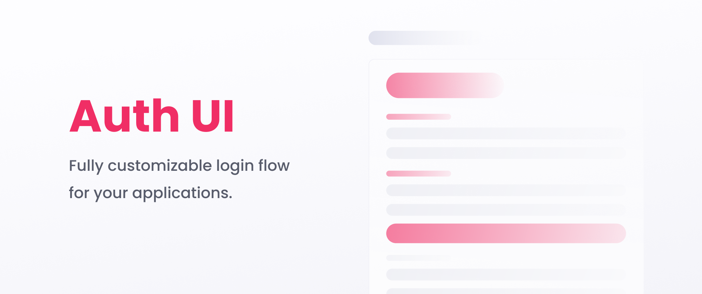
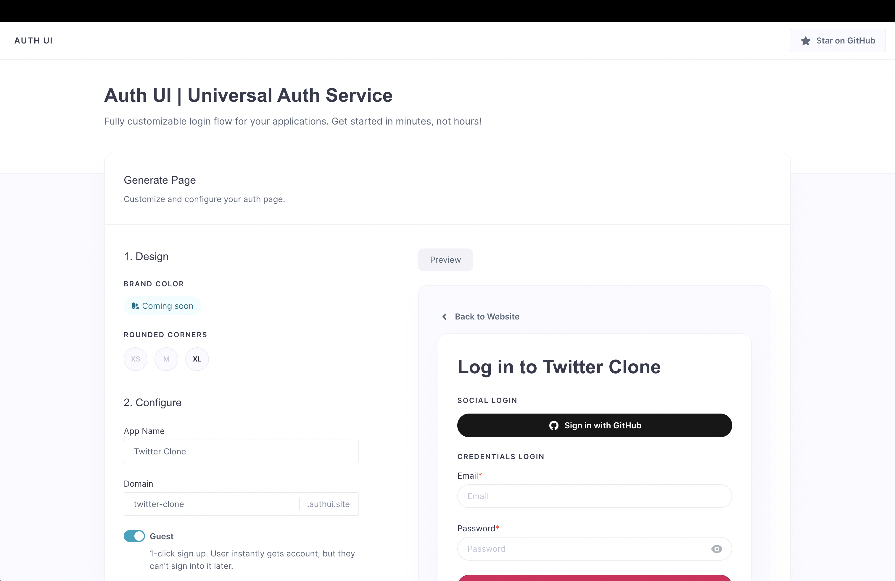
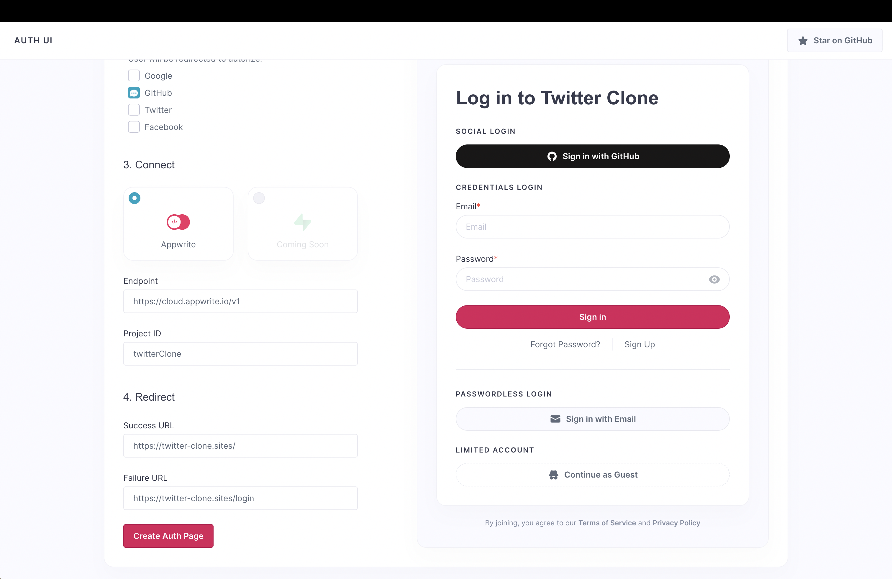
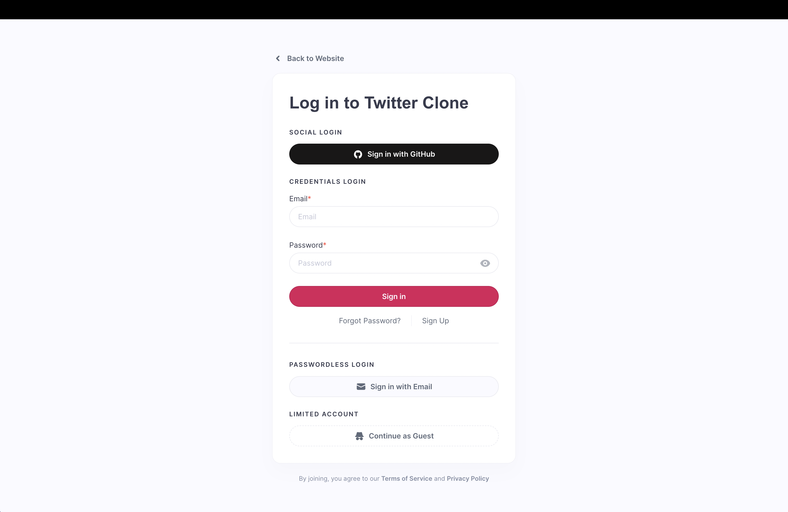
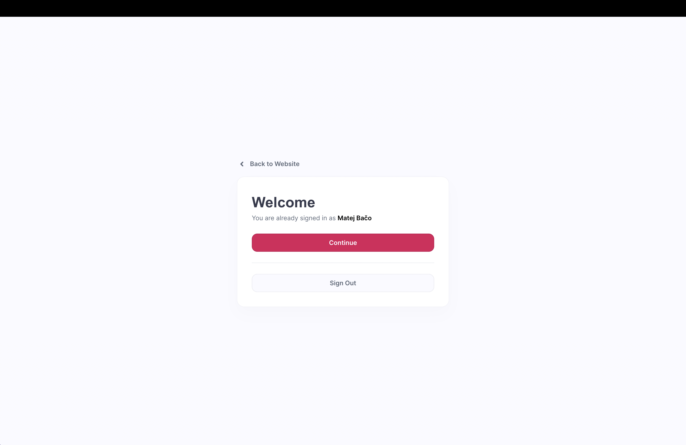

# 🔐 Auth UI

> Fully customizable login flow for your applications. Get started in minutes, not hours!


## 🧰 Tech Stack

- [Appwrite](https://appwrite.io/)
- [Svelte Kit](https://kit.svelte.dev/)
- [TypeScript](https://www.typescriptlang.org/)
- [Pink Design](https://pink.appwrite.io/)

## 🛠️ Setup Server

1. Register [Appwrite](https://cloud.appwrite.io/) account
2. Create project
3. Install Appwrite CLI
4. Login with `appwrite login`
5. Update project ID in `appwrite.json`
6. Deploy database structure with `appwrite deploy collection`

## 👀 Client Setup

1. Copy `.env.example` to `.env`
2. Install libraries `npm install`
3. Update projectID or endpoint in `src/lib/appwrite.ts`, if not using production
4. Start server `npm run dev`

## 🚨 Moderation

Moderate page documents in Appwrite Console. Delete pages that are spam.

## 🚀 Deploy

1. Deploy frontend on root domain such as `myapp.com`
2. Add frontend domain as a platform in Appwrite project

## 🤝 Contributing

To contribute to frontend, make sure to use the [Pink Design](https://pink.appwrite.io/) design system. For state management, [Svelte Stores](https://svelte.dev/tutorial/writable-stores/) should be used.

When contributing to Appwrite Functions, use [Appwrite CLI](https://appwrite.io/docs/command-line). Also use Appwrite CLI to sync changes to project structure such as databases or collections.

## 🔮 Future Plans

- Nicer delete confirmation modal
- Improve Phone login UI
- Account management (claim account, delete account, change name, manage sessions)
- More providers

## 🖼️ Screenshots






## 🤖 Auto-generated documentation
# create-svelte

Everything you need to build a Svelte project, powered by [`create-svelte`](https://github.com/sveltejs/kit/tree/master/packages/create-svelte).

## Creating a project

If you're seeing this, you've probably already done this step. Congrats!

```bash
# create a new project in the current directory
npm create svelte@latest

# create a new project in my-app
npm create svelte@latest my-app
```

## Developing

Once you've created a project and installed dependencies with `npm install` (or `pnpm install` or `yarn`), start a development server:

```bash
npm run dev

# or start the server and open the app in a new browser tab
npm run dev -- --open
```

## Building

To create a production version of your app:

```bash
npm run build
```

You can preview the production build with `npm run preview`.

> To deploy your app, you may need to install an [adapter](https://kit.svelte.dev/docs/adapters) for your target environment.
